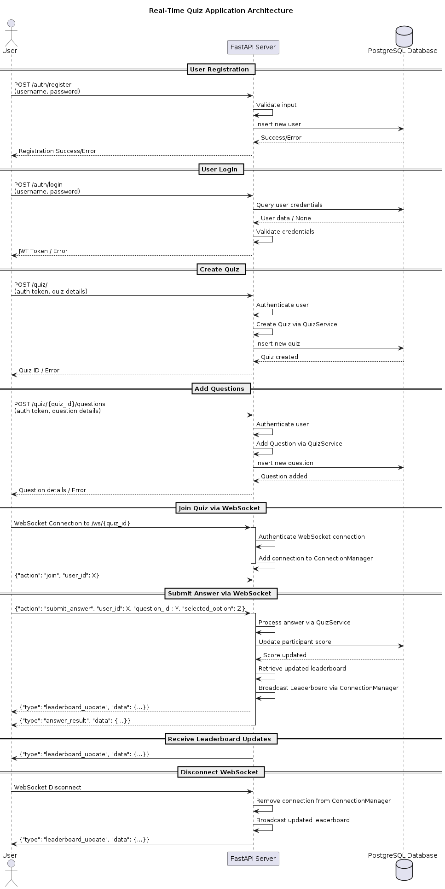

# Real-Time Quiz Application

This project is a real-time quiz application built using FastAPI, WebSocket, and PostgreSQL to deliver scalable and high-performance functionality for users.

## Architecture

Below is the architecture diagram illustrating how the system components interact:



## Features

- Real-time leaderboard updates using WebSocket.
- Modular and scalable architecture using design patterns.
- PostgreSQL for reliable and efficient data handling.

## Technologies Used

- **FastAPI**: For building REST APIs and WebSocket connections.
- **PostgreSQL**: To handle persistent data storage.
- **Docker**: For containerized deployment.

 To achieve a highly modular, maintainable, and scalable application structure, I use Repository, Service Layer, Dependency Injection, Observer, Singleton, and Command design patterns. Each pattern serves a distinct purpose:

 - Repository Pattern: Abstracts data access, promoting separation of concerns.
 - Service Layer Pattern: Encapsulates business logic, enhancing modularity.
 - Dependency Injection: Facilitates easy testing and swapping of components.
 - Observer Pattern: Enables real-time updates to connected clients efficiently.
 - Singleton Pattern: Manages shared resources like logging consistently across the application.
 - Command Pattern: Encapsulates actions, allowing for flexible and reusable operations.

 Best Practices Applied:

 - Clean Code: Clear separation of concerns with modular components.
 - Security: Proper password hashing and secure user authentication.
 - Error Handling: Graceful handling of WebSocket disconnections and internal errors.
 - Testing: The design patterns facilitate easier unit and integration testing.
 - Scalability: The architecture supports scaling by decoupling components and enabling horizontal scaling.

I use PostgreSQL because :
 - it allows multiple transactions can occur simultaneously without locking issues, providing high performance in multi-user environments typical of real-time applications. 
 - ACID Compliance which maintain accurate quiz results and user data. 
 - well-supported Object-Relational Mapping (ORM) tools like SQLAlchemy.
 -  it supports 


Components Included
 - Client Applications: Web browsers, mobile apps, etc.
 - FastAPI Server: Handles HTTP requests, WebSocket connections.
 - Routers: Modular endpoints (auth, quiz, websocket).
 - Services: Business logic layers (UserService, QuizService).
 - Repositories: Data access layers (UserRepository, QuizRepository).
 - Database: PostgreSQL.
 - WebSocket Server: Facilitates real-time communication.
 - Logger: Centralized logging mechanism.

# Backend Installation and Usage Guide

## Installation

### 1. Switch to Root User (required for decryption)

``` 
   sudo su
```
### 2. Activate the Virtual Environment

``` source env/bin/activate ``` 


pip3 freeze > requirements.txt 

4. Apply Database Migrations

Run Alembic to apply migrations:

alembic upgrade head

uvicorn src.main:app --reload

3. Run the Docker Container
Start the application using Docker:
docker build -t fastapi-app .

docker run -p 8000:8000 fastapi-app
Testing
1. Load Testing with Locust
Run Locust to perform load testing on the application:

locust -f tests/load/locustfile.py --host http://localhost:8000

2. End-to-End Testing

Run end-to-end tests using pytest:

pytest -s tests/e2e/test_quiz_e2e.py -k test_full_quiz_flow

3. Integration Testing

Run integration tests for the Quiz Service:

pytest -s tests/integration/test_quiz_service.py
